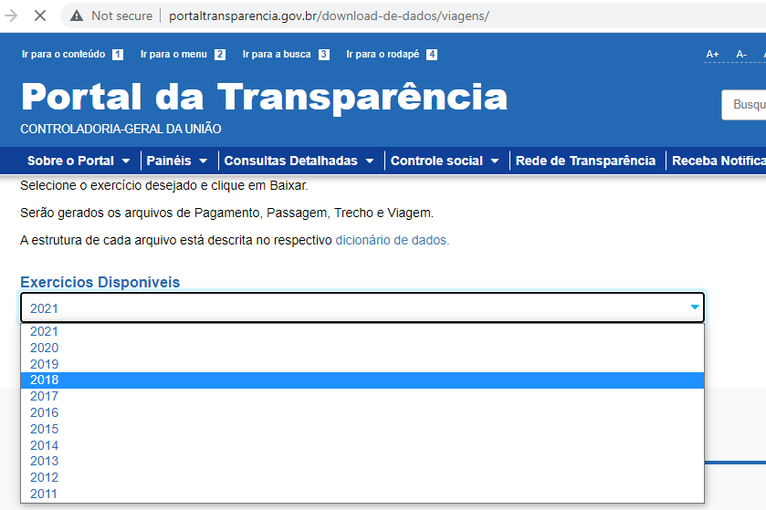

# PYTHON-Dowload-Arquivos

De modo geral, em diversas situações, nas quais posso citar o download de um ou vários arquivos para enriquecimento de dados ou mesmo o download de arquivos que compoem a base de um ETL, podemos utilizar a linguagem python a nosso favor para evitar de realizar o download manualmente.  

Neste exemplo, podemos observar o Portal da Transparência (http://portaltransparencia.gov.br/download-de-dados/viagens/) com relatórios anuais de viagem, no qual sempre atualiza o relatório do ano atual e por ventura, pode ocorrer também alguma atualização nos arquivos de anos anteriores. 

A imagem acima, demonstra a estrutura do site atualmente (08/09/2021, data em que estou publicando este código). Podemos observar que, ao selecionar um determinado ano e efetivar o download, em tempo de execução esse ano é enviado para o final da URL, de modo que a URL seja transformada em: http://portaltransparencia.gov.br/download-de-dados/viagens/2021 para então executar o download.

Pode-se observar na barra do meu navegador que o download de arquivo zipado foi realizado para o ano que selecionei, no caso, 2011. 

Para automatizar essa situação, realizei a adaptação de um script com base em diversas pequenas partes localizadas na internet, no qual ressalto que pode ser melhorada ainda mais, a depender da situação, regra de negócio e principalmente criatividade, caso você esteja estudando sobre Python. 

O script acima foi criado na IDE Spyder. E ao executar, os downloads são iniciados. 

Para melhor controle, optei por exibir o que o script está realizando em determinando momento conforme as imagem acima, podendo ter um maior controle sobre qual horário foi executada a operação de download e posteriormente a descompactação do arquivo. Poderia também salvar esses logs em txt ou outro formato, mas isso fica para uma outra postagem.  
Para concluir, podemos visualizar o resultado do download conforme imagem abaixo: 

Um ponto de atenção é observar a versão do Python instalada na máquina, visto que possuí problemas ao executar esse código em uma versão diferente do meu desktop. Então podem ser necessárias adaptações.
